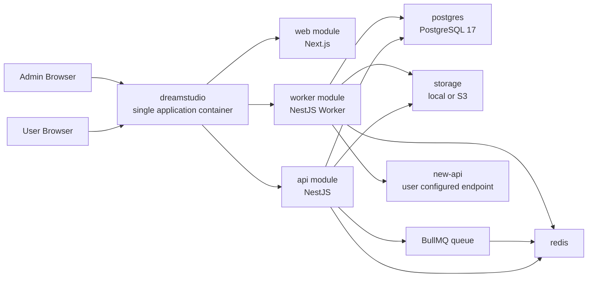

# DreamStudio v1 架构设计

本文档基于 `02-dreamstudio-v1-prd.md` 确认版编写，用于指导后续数据模型、接口契约、开发里程碑和代码实现。

当前版本状态：确认版。

---

## 1. 架构目标

DreamStudio v1 的架构目标是支撑一个依赖用户自有 `new-api` 密钥的 AI 绘画创作平台。

核心要求：

- Web 页面可访问，无需安装客户端。
- DreamStudio 和 `new-api` 独立部署。
- 用户密钥由 DreamStudio 加密保存。
- 生图任务由服务端异步执行。
- 用户关闭页面后任务继续运行。
- 支持本地存储和 S3 兼容对象存储。
- 支持管理员配置模型、存储、任务、日志和用户状态。
- 支持 Docker Compose 部署。

---

## 2. 系统拆分

v1 从逻辑上拆分为六类组件：

- `web module`：Next.js Web 前端模块。
- `api module`：NestJS API 模块。
- `worker module`：NestJS Worker 模块。
- `postgres`：PostgreSQL 17 主数据库。
- `redis`：队列、缓存和会话依赖。
- `storage`：本地文件系统或 S3 兼容对象存储。

部署上，v1 采用一个 `dreamstudio` 应用容器承载 `web module`、`api module` 和 `worker module`。PostgreSQL 和 Redis 可以由 Docker Compose 本地启动，也可以使用云 PostgreSQL 和云 Redis。

### 2.1 组件职责

`web module` 负责：

- 首页。
- 登录和注册。
- AI 创作台。
- 任务状态展示。
- 资产仓库。
- 个人中心。
- 管理后台页面。
- 轻量 BFF 聚合接口。

`api module` 负责：

- 用户认证。
- 权限校验。
- 用户管理。
- `new-api` 配置管理。
- 密钥加密和解密。
- 连接测试。
- 模型管理。
- 任务创建。
- 任务查询。
- 资产管理。
- 系统设置。
- 存储设置。
- 请求日志。
- 审计日志。

`worker module` 负责：

- 消费生图队列。
- 执行 `new-api` 图片生成请求。
- 处理 multipart 或 URL 参考图。
- 下载或解码结果图。
- 保存结果图到存储。
- 更新任务状态。
- 执行自动重试。
- 执行超时处理。
- 执行过期文件清理。

`postgres` 负责：

- 保存业务数据。
- 保存任务状态。
- 保存资产元数据。
- 保存模型配置。
- 保存系统设置。
- 保存日志和审计。

`redis` 负责：

- BullMQ 队列。
- 队列锁。
- 会话或 refresh token 状态。
- 短期任务状态缓存。
- 速率限制计数。

`storage` 负责：

- 保存上传参考图。
- 保存生成结果图。
- 保存可下载资产。

---

## 3. 推荐技术栈

### 3.1 前端

- Next.js。
- React。
- TypeScript。
- Tailwind CSS。
- shadcn/ui。

说明：

- Next.js 负责页面、路由、SSR/CSR 混合体验和轻量 BFF。
- 不将 Next.js Route Handlers 作为任务系统或复杂后端主逻辑。

### 3.2 后端

- NestJS。
- TypeScript。
- Prisma。
- PostgreSQL 17。
- Redis。
- BullMQ。

说明：

- NestJS API 服务承载业务接口。
- NestJS Worker 服务承载队列消费者。
- Prisma 管理数据模型和迁移。
- BullMQ 负责异步任务、重试、延迟和并发控制。

### 3.3 部署

推荐部署形态：

- 一个 `dreamstudio` 应用容器。
- 一个 PostgreSQL 数据库，可使用 Compose 内置 `postgres`，也可使用云 PostgreSQL。
- 一个 Redis 实例，可使用 Compose 内置 `redis`，也可使用云 Redis。

对象存储：

- 本地存储通过 Docker volume 或宿主机目录挂载。
- S3 兼容存储通过外部服务接入。

---

## 4. 架构拓扑



---

## 5. 请求流

### 5.1 首次密钥配置

1. 用户登录 DreamStudio。
2. Web 请求 API 获取当前 `new-api` 配置状态。
3. API 返回未配置状态。
4. Web 展示密钥配置引导。
5. 用户填写 API 密钥。
6. 如果管理员允许自定义服务地址，用户也填写服务地址。
7. API 使用 `/v1/models` 测试服务地址和密钥。
8. API 加密保存密钥。
9. API 记录配置变更审计日志。
10. Web 进入 AI 创作台。

### 5.2 生图任务创建

1. 用户在 Web 选择模型。
2. 用户填写 prompt 和参数。
3. Web 根据模型参数 Schema 校验参数。
4. Web 上传参考图。
5. API 保存参考图到 storage。
6. API 创建任务记录，状态为 `pending`。
7. API 将任务 ID 推入 BullMQ。
8. Web 展示任务卡片。

### 5.3 生图任务执行

1. Worker 从 BullMQ 获取任务。
2. Worker 将任务状态更新为 `running`。
3. Worker 读取用户 `new-api` 配置。
4. Worker 解密用户密钥。
5. Worker 按模型配置选择接口类型。
6. Worker 组装请求参数。
7. Worker 调用 `new-api`。
8. Worker 处理 base64 或 URL 结果。
9. Worker 保存结果图到 storage。
10. Worker 创建资产记录。
11. Worker 将任务状态更新为 `succeeded`。
12. Web 轮询或订阅任务状态并展示结果。

### 5.4 任务取消

1. 用户取消 `pending` 任务。
2. API 检查任务是否仍为 `pending`。
3. API 从队列移除任务或标记为不可执行。
4. API 将任务状态更新为 `canceled`。

对于 `running` 任务：

- v1 返回不可取消。
- v1 不强制真正取消上游 `new-api` 请求。
- v1 不做“前端假取消”状态，避免任务状态和上游真实执行状态不一致。

### 5.5 任务失败

1. Worker 捕获错误。
2. Worker 判断错误类型。
3. 可重试错误交给 BullMQ 自动重试。
4. 不可重试错误直接进入 `failed`。
5. Worker 记录请求日志。
6. API 向前端返回可读错误摘要。

---

## 6. 任务队列设计

### 6.1 队列

v1 使用 BullMQ。

建议队列：

- `image-generation`：生图任务。
- `asset-cleanup`：过期文件清理任务。

### 6.2 任务状态

任务状态：

- `pending`：等待执行。
- `running`：正在执行。
- `succeeded`：成功。
- `failed`：失败。
- `timeout`：超时。
- `canceled`：取消。

### 6.3 并发控制

并发配置：

- 单用户最大并发数：系统设置。
- 全站最大并发数：系统设置。
- Worker 并发数：环境变量或系统设置。

公平调度：

- v1 需要按用户公平调度。
- 推荐使用用户维度限流和全局并发组合实现。
- 每个用户可配置最大运行中任务数。

### 6.4 超时

默认任务超时时间：

- 10 分钟。

超时处理：

- Worker 设置请求超时。
- BullMQ job 设置超时。
- 超时后任务进入 `timeout` 或按错误类型重试。

### 6.5 重试

默认最大重试次数：

- 3 次。

允许自动重试：

- 网络连接错误。
- DNS 临时失败。
- 请求超时。
- `new-api` 返回 5xx。
- 429 限流错误，可带退避重试。

禁止自动重试：

- 额度不足。
- 密钥错误。
- 权限不足。
- 模型不存在。
- 参数校验失败。
- 文件格式不支持。
- 4xx 业务错误，除 429 外。

重试策略：

- 指数退避。
- 每次失败记录错误摘要。
- 最终失败后保留最后一次错误摘要。

---

## 7. new-api 集成

### 7.1 服务地址策略

管理员必须配置默认 `new-api` 服务地址。

默认服务地址：

- 不写死在代码或产品文档中。
- 通过环境变量或管理员初始化配置提供。
- 普通用户注册前必须存在。

用户自定义地址：

- 由管理员开关控制。
- v1 每个用户只允许一个当前生效配置。
- 用户切换服务地址后，历史任务保留原服务地址快照。

### 7.2 连接测试

连接测试接口：

- `/v1/models`。

目的：

- 验证服务地址可访问。
- 验证密钥有效。
- 避免测试调用消耗额度。

测试失败策略：

- 允许保存配置但标记为异常。
- 异常配置不能提交生图任务。

### 7.3 图片接口

第一验收路径：

- `/v1/images/generations`。
- `/v1/images/edits`。

v1 后段兼容目标：

- `/v1beta/models/{model}:generateContent`。

接口选择由模型配置决定。

### 7.4 参考图传递

每个模型单独配置参考图传递方式：

- `multipart`。
- `url`。

通用规则：

- DreamStudio 始终先保存参考图。
- `multipart` 模式下，Worker 读取文件并上传给 `new-api`。
- `url` 模式下，参考图 URL 必须能被 `new-api` 服务访问。

### 7.5 结果图处理

`new-api` 返回 base64：

- Worker 解码成文件。
- 保存到本地或 S3。
- 创建资产记录。

`new-api` 返回 URL：

- Worker 下载图片。
- 保存到本地或 S3。
- 创建资产记录。

DreamStudio 不直接依赖上游结果 URL 作为长期资产地址。

---

## 8. 密钥加密设计

### 8.1 存储原则

用户 `new-api` API 密钥必须加密保存。

禁止：

- 明文存储。
- 日志打印完整密钥。
- 管理员查看已保存密钥明文。
- 在请求日志中保存完整 Authorization Header。

允许：

- 用户自行重置密钥。
- 管理员代用户配置或重置密钥。
- 页面展示掩码。

### 8.2 加密方案

v1 推荐：

- AES-256-GCM。
- 主密钥通过环境变量 `DREAMSTUDIO_SECRET_KEY` 提供。
- 数据库存储密文、IV、认证标签和 key version。

建议字段：

- `encrypted_api_key`。
- `key_iv`。
- `key_tag`。
- `key_version`。
- `masked_api_key`。

### 8.3 主密钥

主密钥要求：

- 部署时必须提供。
- 不写入数据库。
- 不写入镜像。
- 不写入日志。

主密钥丢失：

- 已保存密钥不可恢复。
- 用户需要重新填写密钥。
- 管理员可代用户重置密钥。

密钥轮换：

- v1 数据结构预留 `key_version`。
- v1 可先不做在线批量轮换。
- 后续可通过后台任务逐条解密再加密。

### 8.4 审计

必须记录审计：

- 用户自行保存密钥。
- 用户自行重置密钥。
- 管理员代用户配置密钥。
- 管理员代用户重置密钥。

审计日志不记录密钥明文。

---

## 9. 模型参数 Schema

### 9.1 目标

不同图片模型支持的参数不同，v1 使用模型级参数 Schema 避免前端展示不可用参数。

### 9.2 Schema 内容

每个模型配置：

- 模型 ID。
- 展示名称。
- 厂商名称。
- 分类。
- 接口类型。
- 是否启用。
- 是否推荐。
- 是否支持参考图。
- 参考图传递方式。
- 默认参数。
- 参数 Schema。

参数 Schema 描述：

- 参数名称。
- 参数类型。
- 默认值。
- 是否必填。
- 可选值。
- 最小值。
- 最大值。
- 是否高级参数。
- 前端展示组件类型。
- 映射到上游请求字段的路径。

### 9.3 常见参数

v1 常见参数：

- `prompt`。
- `negative_prompt`。
- `size`。
- `aspect_ratio`。
- `resolution`。
- `n`。
- `seed`。
- `quality`。
- `response_format`。
- `reference_images`。

### 9.4 参数切换

模型切换时：

- 保留通用参数。
- 清空目标模型不支持的参数。
- 禁用目标模型不支持的 UI 控件。
- 如果参考图不兼容，提示用户移除参考图。

### 9.5 校验位置

前端校验：

- 提供即时提示。
- 禁止明显不合法参数提交。

后端校验：

- 作为最终可信校验。
- 防止绕过前端提交非法参数。
- 生成标准化任务参数快照。

---

## 10. 文件存储设计

### 10.1 存储类型

v1 支持：

- 本地存储。
- S3 兼容对象存储。

### 10.2 默认本地路径

默认本地路径：

- 参考图：`/data/image/input`。
- 结果图：`/data/image/output`。

### 10.3 S3 配置

S3 需要支持：

- endpoint。
- region。
- bucket。
- access key。
- secret key。
- public base URL。

参考图和结果图：

- 可配置独立 bucket。
- 可配置独立 key prefix。
- 可配置独立保留时间。

### 10.4 文件命名

文件名需要人类可读，但不能依赖用户输入作为唯一标识。

推荐格式：

```text
{yyyy}/{mm}/{dd}/{task_id}-{asset_kind}-{short_id}.{ext}
```

示例：

```text
2026/06/19/imgtask_abc123-result-a1b2c3.png
```

### 10.5 保留策略

默认保留时间：

- 参考图：12 小时。
- 结果图：12 小时。

管理员可分别配置：

- 参考图保留时间。
- 结果图保留时间。

v1 不提供永不过期选项。

### 10.6 删除策略

用户删除资产：

- 同步删除资产记录。
- 同步删除物理文件。
- 删除前二次确认。

管理员清理过期文件：

- Worker 定时扫描过期资产。
- 删除物理文件。
- 标记资产为已清理。

---

## 11. 日志与审计

### 11.1 请求日志

请求日志用于管理员排查问题。

默认保留时间：

- 180 天。

记录内容：

- 请求用户。
- 服务地址域名。
- 模型 ID。
- 接口类型。
- 任务 ID。
- 请求时间。
- 响应时间。
- 状态。
- HTTP 状态码。
- 错误摘要。
- prompt 摘要。
- 脱敏参数快照。

不记录：

- 完整 API 密钥。
- 完整 Authorization Header。
- 未脱敏敏感字段。

完整 prompt 和完整参数：

- 可以加密或受限保存。
- 管理员查看需要权限。
- 查看行为必须写审计日志。

### 11.2 审计日志

审计日志用于追踪敏感管理操作。

默认保留时间：

- 365 天。

必须记录：

- 管理员登录后台。
- 启用用户。
- 禁用用户。
- 软删除用户。
- 重置用户密码。
- 管理员代用户配置密钥。
- 管理员代用户重置密钥。
- 修改默认 `new-api` 服务地址。
- 修改是否允许用户自定义服务地址。
- 修改存储配置。
- 修改任务超时和重试配置。
- 查看完整 prompt。
- 查看完整参数快照。

记录字段：

- 操作者用户 ID。
- 操作类型。
- 目标资源类型。
- 目标资源 ID。
- 操作者 IP。
- User-Agent。
- 操作时间。
- 结果状态。

---

## 12. 数据边界

### 12.1 PostgreSQL

PostgreSQL 保存：

- 用户。
- 会话元数据。
- 用户 `new-api` 配置。
- 模型目录。
- 模型参数 Schema。
- 生图任务。
- 资产元数据。
- 系统设置。
- 存储设置。
- 请求日志。
- 审计日志。

### 12.2 Redis

Redis 保存：

- BullMQ 队列。
- 队列锁。
- 会话或 refresh token。
- 短期任务状态缓存。
- 限流计数。

Redis 不作为长期业务数据的唯一来源。

### 12.3 Storage

Storage 保存：

- 上传参考图。
- 生成结果图。

Storage 不保存：

- 用户密钥。
- 任务业务状态。
- 审计日志。

---

## 13. API 边界

### 13.1 Web 调 API

Web 只调用 DreamStudio API，不直接调用用户配置的 `new-api`。

原因：

- 避免密钥暴露到浏览器。
- 统一权限校验。
- 统一任务管理。
- 统一日志与审计。

### 13.2 API 调 new-api

API 只做轻量连接测试。

Worker 执行真正的生图调用。

原因：

- 避免 API 请求长时间阻塞。
- 保证用户关闭页面后任务继续执行。
- 让重试和超时进入队列系统。

---

## 14. Docker Compose 设计

### 14.1 服务

推荐服务：

- `dreamstudio`：单应用容器，内部运行 Web、API 和 Worker 逻辑模块。

可选 Compose 内置服务：

- `postgres`：本地 PostgreSQL。
- `redis`：本地 Redis。

可选外部服务：

- 云 PostgreSQL。
- 云 Redis。
- S3 兼容对象存储。
- 错误追踪服务。

部署原则：

- v1 默认按一个 `dreamstudio` 容器交付，降低部署和维护复杂度。
- `DATABASE_URL` 可以指向本地 Compose PostgreSQL，也可以指向云 PostgreSQL。
- `REDIS_URL` 可以指向本地 Compose Redis，也可以指向云 Redis。
- 如果后续任务量增大，可以再将 Worker 从单容器中拆出为独立容器横向扩容。

### 14.1.1 单容器进程模型

`dreamstudio` 单容器内部建议运行三个逻辑进程：

- Web 进程：运行 Next.js Web。
- API 进程：运行 NestJS API。
- Worker 进程：运行 BullMQ Worker。

实现建议：

- 使用容器 entrypoint 启动三个进程，并将日志输出到 stdout/stderr。
- 任一关键进程退出时，容器应整体退出，由 Docker 重启策略拉起。
- 健康检查至少覆盖 Web/API 可访问性和 Redis/PostgreSQL 连接。
- Worker 进程崩溃不能静默失败。

后续扩容：

- v1 先保持单容器。
- 当任务量增长时，优先将 Worker 拆成独立容器扩容。

### 14.2 环境变量

关键环境变量：

- `DATABASE_URL`。
- `REDIS_URL`。
- `DREAMSTUDIO_SECRET_KEY`。
- `APP_BASE_URL`。
- `COOKIE_SECRET` 或 session secret。
- `NODE_ENV`。
- `LOCAL_STORAGE_ROOT`。

说明：

- 环境变量只保存启动级配置和主密钥。
- 默认 `new-api` 服务地址通过初始化系统设置或管理员后台配置。
- 存储驱动、本地路径、S3 endpoint、bucket、access key、secret key 和 public base URL 通过后台存储设置保存。
- S3 密钥必须加密入库，不作为长期环境变量配置。

### 14.3 初始化

Docker Compose 首次启动需要支持：

- 数据库迁移。
- 创建默认超级管理员。
- 初始化默认系统设置。
- 初始化默认存储配置。

---

## 15. 可选备份建议

v1 不强制内置自动备份，备份不作为 v1 强制验收项。部署文档可以提供可选备份建议，供生产运维按需采用。

需要说明：

- PostgreSQL 备份命令。
- PostgreSQL 恢复命令。
- 本地上传文件备份路径。
- S3 资产备份建议。
- 主密钥丢失后的恢复边界。

注意：

- 如果 `DREAMSTUDIO_SECRET_KEY` 丢失，已保存用户密钥不可恢复。
- 如果选择做数据库备份，应同时考虑 `DREAMSTUDIO_SECRET_KEY` 备份，否则加密内容可能不可恢复。

---

## 16. 后续文档输入

本架构文档确定后，下一步产出：

1. `04-dreamstudio-v1-data-model.md`
2. `05-dreamstudio-v1-api-contract.md`
3. `06-dreamstudio-v1-milestones.md`
