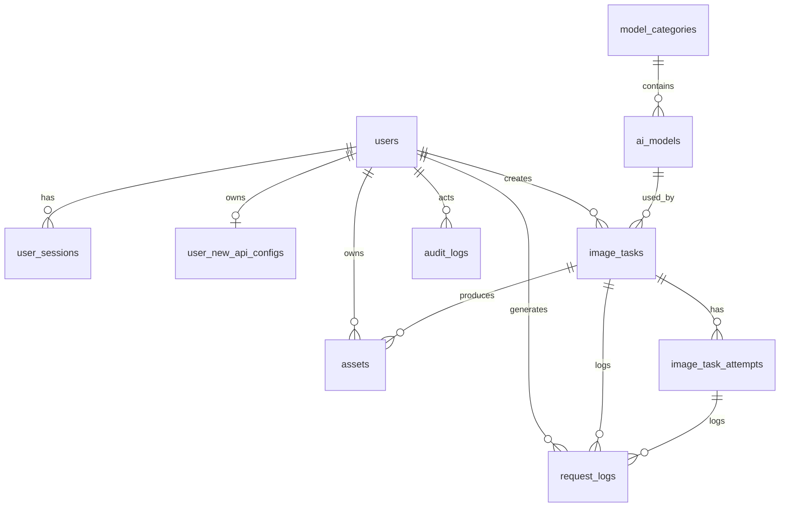

# DreamStudio v1 数据模型设计

本文档基于 `02-dreamstudio-v1-prd.md` 和 `03-dreamstudio-v1-architecture.md` 编写，用于指导 Prisma schema、数据库迁移、接口契约和开发实现。

当前版本状态：确认版。

---

## 1. 设计原则

### 1.1 数据库

v1 使用 PostgreSQL 17 作为主数据库。

设计原则：

- 所有主键使用 UUID。
- 所有业务表包含 `created_at` 和 `updated_at`。
- 用户、模型、任务、资产等核心表使用软删除。
- Redis 不作为长期业务数据的唯一来源。
- 敏感字段必须加密或脱敏。
- JSONB 用于模型参数 Schema、任务参数快照、脱敏参数快照等结构化扩展字段。

### 1.2 命名约定

表名使用复数 snake_case：

- `users`
- `image_tasks`
- `assets`

字段名使用 snake_case：

- `created_at`
- `deleted_at`
- `new_api_base_url`

枚举值使用小写 snake_case：

- `pending`
- `reference_image`
- `local`

### 1.3 时间字段

通用时间字段：

- `created_at`
- `updated_at`
- `deleted_at`

需要审计或状态流转的表增加：

- `last_login_at`
- `started_at`
- `completed_at`
- `expires_at`
- `cleaned_at`

---

## 2. 枚举

### 2.1 用户角色

`user_role`

- `user`
- `super_admin`

### 2.2 用户状态

`user_status`

- `active`
- `disabled`
- `deleted`

### 2.3 new-api 配置状态

`new_api_config_status`

- `untested`
- `valid`
- `invalid`

### 2.4 模型接口类型

`model_endpoint_type`

- `openai_image_generations`
- `openai_image_edits`
- `gemini_generate_content`

### 2.5 参考图传递方式

`reference_transfer_mode`

- `none`
- `multipart`
- `url`

### 2.6 任务状态

`image_task_status`

- `pending`
- `running`
- `succeeded`
- `failed`
- `timeout`
- `canceled`

### 2.7 资产类型

`asset_kind`

- `reference_image`
- `result_image`

### 2.8 资产状态

`asset_status`

- `available`
- `deleted`
- `expired_cleaned`

### 2.9 存储类型

`storage_driver`

- `local`
- `s3`

### 2.10 日志状态

`request_log_status`

- `succeeded`
- `failed`
- `timeout`
- `canceled`

### 2.11 审计结果

`audit_result`

- `success`
- `failed`

---

## 3. 用户与认证

### 3.1 users

保存 DreamStudio 用户账号。

核心字段：

| 字段 | 类型 | 说明 |
| --- | --- | --- |
| `id` | uuid pk | 用户 ID |
| `username` | varchar unique | 登录用户名 |
| `password_hash` | varchar | 密码哈希 |
| `role` | user_role | 用户角色 |
| `status` | user_status | 用户状态 |
| `display_name` | varchar nullable | 展示名 |
| `last_login_at` | timestamptz nullable | 最近登录时间 |
| `disabled_at` | timestamptz nullable | 禁用时间 |
| `deleted_at` | timestamptz nullable | 软删除时间 |
| `created_at` | timestamptz | 创建时间 |
| `updated_at` | timestamptz | 更新时间 |

索引：

- unique `username`
- index `role`
- index `status`
- index `deleted_at`

规则：

- v1 支持软删除，不做物理删除。
- 被禁用用户不能登录。
- 用户被禁用后，现有登录态必须失效。

### 3.2 user_sessions

保存登录态元数据。Redis 可保存会话状态，但 PostgreSQL 保留可审计记录。

核心字段：

| 字段 | 类型 | 说明 |
| --- | --- | --- |
| `id` | uuid pk | 会话 ID |
| `user_id` | uuid fk users.id | 用户 ID |
| `refresh_token_hash` | varchar nullable | refresh token 哈希 |
| `ip_address` | inet nullable | 登录 IP |
| `user_agent` | text nullable | User-Agent |
| `expires_at` | timestamptz | 默认 30 天 |
| `revoked_at` | timestamptz nullable | 失效时间 |
| `created_at` | timestamptz | 创建时间 |
| `updated_at` | timestamptz | 更新时间 |

索引：

- index `user_id`
- index `expires_at`
- index `revoked_at`

规则：

- Redis 中的会话状态用于快速校验。
- PostgreSQL 中的记录用于追踪和批量失效。

---

## 4. new-api 配置

### 4.1 user_new_api_configs

保存用户的 `new-api` 服务地址和 API 密钥配置。v1 每个用户只允许一个当前生效配置。

核心字段：

| 字段 | 类型 | 说明 |
| --- | --- | --- |
| `id` | uuid pk | 配置 ID |
| `user_id` | uuid fk users.id unique | 用户 ID |
| `new_api_base_url` | text | 实际使用的服务地址 |
| `uses_custom_base_url` | boolean | 是否使用用户自定义地址 |
| `encrypted_api_key` | text | 加密后的 API 密钥 |
| `key_iv` | text | AES-GCM IV |
| `key_tag` | text | AES-GCM tag |
| `key_version` | integer | 主密钥版本 |
| `masked_api_key` | varchar | 掩码展示值 |
| `status` | new_api_config_status | 配置状态 |
| `last_tested_at` | timestamptz nullable | 最近测试时间 |
| `last_test_error` | text nullable | 最近测试错误摘要 |
| `created_at` | timestamptz | 创建时间 |
| `updated_at` | timestamptz | 更新时间 |

索引：

- unique `user_id`
- index `status`
- index `last_tested_at`

规则：

- 密钥不能明文保存。
- 管理员不能查看已保存密钥明文。
- 管理员代用户配置或重置密钥时写审计日志。
- 历史任务需要保存服务地址快照，避免用户切换地址后影响旧任务排查。

---

## 5. 模型目录

### 5.1 model_categories

保存模型分类。

核心字段：

| 字段 | 类型 | 说明 |
| --- | --- | --- |
| `id` | uuid pk | 分类 ID |
| `name` | varchar | 分类名称 |
| `slug` | varchar unique | 分类标识 |
| `icon` | varchar nullable | 图标标识 |
| `sort_order` | integer | 排序 |
| `is_enabled` | boolean | 是否启用 |
| `created_at` | timestamptz | 创建时间 |
| `updated_at` | timestamptz | 更新时间 |
| `deleted_at` | timestamptz nullable | 软删除时间 |

索引：

- unique `slug`
- index `sort_order`
- index `is_enabled`

### 5.2 ai_models

保存管理员维护的模型目录。

核心字段：

| 字段 | 类型 | 说明 |
| --- | --- | --- |
| `id` | uuid pk | 模型记录 ID |
| `category_id` | uuid fk model_categories.id nullable | 分类 ID |
| `model_id` | varchar | 上游模型 ID |
| `display_name` | varchar | 前台展示名称 |
| `provider_name` | varchar nullable | 厂商名称 |
| `endpoint_type` | model_endpoint_type | 接口类型 |
| `reference_transfer_mode` | reference_transfer_mode | 参考图传递方式 |
| `supports_reference_image` | boolean | 是否支持参考图 |
| `is_enabled` | boolean | 是否启用 |
| `is_recommended` | boolean | 是否推荐 |
| `sort_order` | integer | 排序 |
| `default_params` | jsonb | 默认参数 |
| `parameter_schema` | jsonb | 参数 Schema |
| `created_at` | timestamptz | 创建时间 |
| `updated_at` | timestamptz | 更新时间 |
| `deleted_at` | timestamptz nullable | 软删除时间 |

索引：

- partial unique `model_id`, `endpoint_type` where `deleted_at is null`
- index `category_id`
- index `endpoint_type`
- index `is_enabled`
- index `is_recommended`
- index `sort_order`

规则：

- 只有启用模型展示给普通用户。
- 模型参数以 `parameter_schema` 为准。
- Gemini 风格接口进入 v1 后段兼容目标，不作为第一验收路径。

### 5.3 model_sync_snapshots

保存管理员从 `new-api` 拉取模型候选列表的快照，方便排查和导入。

核心字段：

| 字段 | 类型 | 说明 |
| --- | --- | --- |
| `id` | uuid pk | 快照 ID |
| `base_url` | text | 拉取来源地址 |
| `operator_id` | uuid fk users.id | 操作者 |
| `raw_response` | jsonb | 原始模型列表 |
| `model_count` | integer | 模型数量 |
| `created_at` | timestamptz | 创建时间 |

索引：

- index `operator_id`
- index `created_at`

---

## 6. 图片任务

### 6.1 image_tasks

保存 AI 绘画任务。

核心字段：

| 字段 | 类型 | 说明 |
| --- | --- | --- |
| `id` | uuid pk | 任务 ID |
| `user_id` | uuid fk users.id | 用户 ID |
| `client_request_id` | varchar nullable | 前端幂等请求 ID |
| `model_record_id` | uuid fk ai_models.id | 模型记录 ID |
| `model_id_snapshot` | varchar | 上游模型 ID 快照 |
| `endpoint_type_snapshot` | model_endpoint_type | 接口类型快照 |
| `new_api_base_url_snapshot` | text | 服务地址快照 |
| `status` | image_task_status | 任务状态 |
| `prompt_summary` | text nullable | prompt 摘要 |
| `encrypted_prompt` | text nullable | 加密完整 prompt |
| `prompt_iv` | text nullable | prompt IV |
| `prompt_tag` | text nullable | prompt tag |
| `negative_prompt_summary` | text nullable | 负面提示词摘要 |
| `encrypted_negative_prompt` | text nullable | 加密完整负面提示词 |
| `negative_prompt_iv` | text nullable | negative prompt IV |
| `negative_prompt_tag` | text nullable | negative prompt tag |
| `parameter_snapshot` | jsonb | 标准化任务参数 |
| `sanitized_parameter_snapshot` | jsonb | 脱敏参数快照 |
| `reference_transfer_mode_snapshot` | reference_transfer_mode | 参考图传递方式快照 |
| `attempt_count` | integer | 已尝试次数 |
| `max_attempts` | integer | 最大尝试次数 |
| `timeout_seconds` | integer | 超时时间 |
| `last_error_code` | varchar nullable | 最后错误码 |
| `last_error_message` | text nullable | 最后错误摘要 |
| `started_at` | timestamptz nullable | 开始时间 |
| `completed_at` | timestamptz nullable | 完成时间 |
| `canceled_at` | timestamptz nullable | 取消时间 |
| `created_at` | timestamptz | 创建时间 |
| `updated_at` | timestamptz | 更新时间 |
| `deleted_at` | timestamptz nullable | 软删除时间 |

索引：

- index `user_id`, `created_at`
- partial unique `user_id`, `client_request_id` where `client_request_id is not null`
- index `status`
- index `model_record_id`
- index `created_at`
- index `completed_at`
- index `deleted_at`

规则：

- 任务创建后必须保存模型、接口、服务地址和参数快照。
- 同一用户重复提交相同 `client_request_id` 时，应返回已创建任务，避免前端重试导致重复扣费。
- 任务列表默认展示 prompt 摘要和负面提示词摘要，不直接展示完整 prompt。
- 完整 prompt 和完整负面提示词作为敏感内容加密保存。
- 任务使用快照执行，不受后续模型配置变更影响。
- 用户取消 `pending` 任务后状态为 `canceled`。
- `running` 任务 v1 返回不可取消，不强制取消上游请求。

### 6.2 image_task_attempts

保存每次任务尝试，方便重试排查。

核心字段：

| 字段 | 类型 | 说明 |
| --- | --- | --- |
| `id` | uuid pk | 尝试 ID |
| `task_id` | uuid fk image_tasks.id | 任务 ID |
| `attempt_no` | integer | 第几次尝试 |
| `status` | request_log_status | 尝试结果 |
| `started_at` | timestamptz | 开始时间 |
| `finished_at` | timestamptz nullable | 结束时间 |
| `http_status` | integer nullable | HTTP 状态码 |
| `error_code` | varchar nullable | 错误码 |
| `error_message` | text nullable | 错误摘要 |
| `is_retryable` | boolean | 是否可重试 |
| `created_at` | timestamptz | 创建时间 |

索引：

- index `task_id`
- unique `task_id`, `attempt_no`
- index `status`
- index `created_at`

---

## 7. 资产

### 7.1 assets

保存参考图和结果图的元数据。

核心字段：

| 字段 | 类型 | 说明 |
| --- | --- | --- |
| `id` | uuid pk | 资产 ID |
| `user_id` | uuid fk users.id | 用户 ID |
| `task_id` | uuid fk image_tasks.id nullable | 关联任务 |
| `kind` | asset_kind | 资产类型 |
| `status` | asset_status | 资产状态 |
| `storage_driver` | storage_driver | 存储类型 |
| `bucket` | varchar nullable | S3 bucket |
| `object_key` | text | S3 key 或本地相对路径 |
| `public_url` | text nullable | 公开访问 URL |
| `original_filename` | varchar nullable | 原始文件名 |
| `mime_type` | varchar | MIME 类型 |
| `file_ext` | varchar | 文件扩展名 |
| `size_bytes` | bigint nullable | 文件大小 |
| `width` | integer nullable | 图片宽度 |
| `height` | integer nullable | 图片高度 |
| `checksum_sha256` | varchar nullable | 文件校验 |
| `expires_at` | timestamptz nullable | 过期时间 |
| `deleted_at` | timestamptz nullable | 用户删除时间 |
| `cleaned_at` | timestamptz nullable | 物理清理时间 |
| `created_at` | timestamptz | 创建时间 |
| `updated_at` | timestamptz | 更新时间 |

索引：

- index `user_id`, `created_at`
- index `task_id`
- index `kind`
- index `status`
- index `expires_at`
- index `deleted_at`
- index `cleaned_at`

规则：

- 用户删除资产时同步删除物理文件。
- 过期清理由 Worker 执行。
- 删除后不可恢复。
- 参考图默认保留 12 小时。
- 结果图默认保留 12 小时。

---

## 8. 请求日志

### 8.1 request_logs

保存请求日志，供管理员排查故障。

核心字段：

| 字段 | 类型 | 说明 |
| --- | --- | --- |
| `id` | uuid pk | 日志 ID |
| `user_id` | uuid fk users.id nullable | 请求用户 |
| `task_id` | uuid fk image_tasks.id nullable | 任务 ID |
| `attempt_id` | uuid fk image_task_attempts.id nullable | 尝试 ID |
| `new_api_base_url_host` | varchar nullable | 服务地址域名 |
| `model_id` | varchar nullable | 模型 ID |
| `endpoint_type` | model_endpoint_type nullable | 接口类型 |
| `status` | request_log_status | 请求状态 |
| `http_status` | integer nullable | HTTP 状态码 |
| `duration_ms` | integer nullable | 响应耗时 |
| `prompt_summary` | text nullable | prompt 摘要 |
| `encrypted_prompt` | text nullable | 加密完整 prompt |
| `prompt_iv` | text nullable | prompt IV |
| `prompt_tag` | text nullable | prompt tag |
| `sanitized_params` | jsonb nullable | 脱敏参数 |
| `encrypted_params` | text nullable | 加密完整参数 |
| `params_iv` | text nullable | params IV |
| `params_tag` | text nullable | params tag |
| `error_code` | varchar nullable | 错误码 |
| `error_message` | text nullable | 错误摘要 |
| `created_at` | timestamptz | 创建时间 |
| `expires_at` | timestamptz | 默认 180 天 |

索引：

- index `user_id`
- index `task_id`
- index `status`
- index `model_id`
- index `created_at`
- index `expires_at`

规则：

- 默认展示 prompt 摘要和脱敏参数。
- 管理员查看完整 prompt 或完整参数必须写审计日志。
- 不保存完整 API 密钥。
- 不保存完整 Authorization Header。

---

## 9. 审计日志

### 9.1 audit_logs

保存敏感操作审计。

核心字段：

| 字段 | 类型 | 说明 |
| --- | --- | --- |
| `id` | uuid pk | 审计 ID |
| `actor_user_id` | uuid fk users.id nullable | 操作者 |
| `action` | varchar | 操作类型 |
| `target_type` | varchar | 目标资源类型 |
| `target_id` | uuid nullable | 目标资源 ID |
| `result` | audit_result | 操作结果 |
| `ip_address` | inet nullable | 操作者 IP |
| `user_agent` | text nullable | User-Agent |
| `metadata` | jsonb nullable | 附加信息 |
| `created_at` | timestamptz | 创建时间 |
| `expires_at` | timestamptz | 默认 365 天 |

索引：

- index `actor_user_id`
- index `action`
- index `target_type`, `target_id`
- index `created_at`
- index `expires_at`

必须审计：

- 管理员登录后台。
- 启用用户。
- 禁用用户。
- 软删除用户。
- 重置用户密码。
- 用户自行保存密钥。
- 用户自行重置密钥。
- 管理员代用户配置密钥。
- 管理员代用户重置密钥。
- 修改默认 `new-api` 服务地址。
- 修改是否允许用户自定义服务地址。
- 修改存储配置。
- 修改任务超时和重试配置。
- 查看完整 prompt。
- 查看完整参数快照。

---

## 10. 系统设置

### 10.1 system_settings

保存全局系统设置。

核心字段：

| 字段 | 类型 | 说明 |
| --- | --- | --- |
| `key` | varchar pk | 设置键 |
| `value` | jsonb | 设置值 |
| `description` | text nullable | 描述 |
| `updated_by` | uuid fk users.id nullable | 更新人 |
| `created_at` | timestamptz | 创建时间 |
| `updated_at` | timestamptz | 更新时间 |

建议设置键：

- `default_new_api_base_url`
- `allow_user_custom_new_api_base_url`
- `registration_enabled`
- `image_task_timeout_seconds`
- `image_task_max_attempts`
- `image_task_retry_backoff_seconds`
- `per_user_running_task_limit`
- `global_running_task_limit`
- `request_log_retention_hours`
- `audit_log_retention_hours`

### 10.2 storage_settings

保存存储配置。

核心字段：

| 字段 | 类型 | 说明 |
| --- | --- | --- |
| `id` | uuid pk | 配置 ID |
| `driver` | storage_driver | 存储类型 |
| `is_active` | boolean | 是否当前生效 |
| `local_input_path` | text nullable | 本地参考图路径 |
| `local_output_path` | text nullable | 本地结果图路径 |
| `s3_endpoint` | text nullable | S3 endpoint |
| `s3_region` | varchar nullable | S3 region |
| `s3_input_bucket` | varchar nullable | 参考图 bucket |
| `s3_output_bucket` | varchar nullable | 结果图 bucket |
| `s3_input_prefix` | text nullable | 参考图 prefix |
| `s3_output_prefix` | text nullable | 结果图 prefix |
| `s3_public_base_url` | text nullable | 公开访问基础 URL |
| `encrypted_s3_access_key_id` | text nullable | 加密 access key |
| `s3_access_key_iv` | text nullable | access key IV |
| `s3_access_key_tag` | text nullable | access key tag |
| `encrypted_s3_secret_access_key` | text nullable | 加密 secret key |
| `s3_secret_key_iv` | text nullable | secret key IV |
| `s3_secret_key_tag` | text nullable | secret key tag |
| `key_version` | integer nullable | 主密钥版本 |
| `reference_retention_hours` | integer | 默认 12 |
| `result_retention_hours` | integer | 默认 12 |
| `updated_by` | uuid fk users.id nullable | 更新人 |
| `created_at` | timestamptz | 创建时间 |
| `updated_at` | timestamptz | 更新时间 |

索引：

- index `driver`
- index `is_active`

规则：

- v1 同一时间只允许一个生效存储配置。
- S3 密钥也必须加密保存。
- 修改存储配置必须写审计日志。

---

## 11. 清理任务

### 11.1 cleanup_runs

保存过期资产清理记录。

核心字段：

| 字段 | 类型 | 说明 |
| --- | --- | --- |
| `id` | uuid pk | 清理批次 ID |
| `started_at` | timestamptz | 开始时间 |
| `finished_at` | timestamptz nullable | 结束时间 |
| `asset_kind` | asset_kind nullable | 清理类型 |
| `scanned_count` | integer | 扫描数量 |
| `cleaned_count` | integer | 清理数量 |
| `failed_count` | integer | 失败数量 |
| `error_message` | text nullable | 错误摘要 |
| `created_at` | timestamptz | 创建时间 |

索引：

- index `started_at`
- index `asset_kind`

---

## 12. 关系概览

---

## 13. Prisma 映射注意

### 13.1 JSONB 字段

建议使用 JSONB：

- `ai_models.default_params`
- `ai_models.parameter_schema`
- `image_tasks.parameter_snapshot`
- `image_tasks.sanitized_parameter_snapshot`
- `request_logs.sanitized_params`
- `audit_logs.metadata`
- `system_settings.value`

### 13.2 加密字段

以下字段由应用层加密后写入数据库：

- 用户 `new-api` API 密钥。
- S3 access key。
- S3 secret key。
- 完整 prompt。
- 完整负面提示词。
- 完整请求参数。

### 13.2.1 PostgreSQL 部分唯一索引

以下约束需要使用 raw migration 创建：

- `ai_models(model_id, endpoint_type) where deleted_at is null`
- `image_tasks(user_id, client_request_id) where client_request_id is not null`

原因：

- PostgreSQL 中普通 unique index 允许多个 `NULL`。
- `unique(model_id, endpoint_type, deleted_at)` 不能保证未删除模型唯一。
- `client_request_id` 允许为空，但非空时需要按用户维度保证幂等。

### 13.3 软删除

软删除字段：

- `users.deleted_at`
- `model_categories.deleted_at`
- `ai_models.deleted_at`
- `image_tasks.deleted_at`
- `assets.deleted_at`

查询默认排除软删除记录。

### 13.4 迁移顺序

建议迁移顺序：

1. 枚举。
2. `users`
3. `user_sessions`
4. `user_new_api_configs`
5. `model_categories`
6. `ai_models`
7. `image_tasks`
8. `image_task_attempts`
9. `assets`
10. `request_logs`
11. `audit_logs`
12. `system_settings`
13. `storage_settings`
14. `cleanup_runs`

---

## 14. 后续文档输入

本数据模型确定后，下一步产出：

1. `05-dreamstudio-v1-api-contract.md`
2. `06-dreamstudio-v1-milestones.md`
