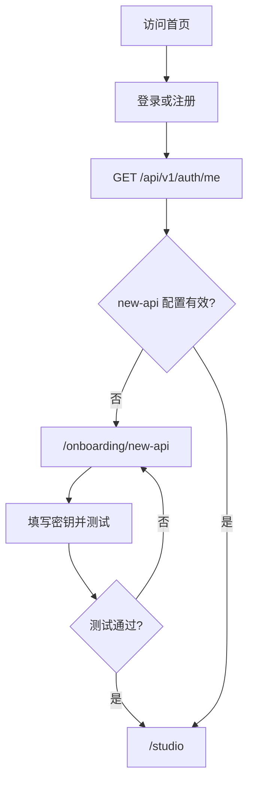
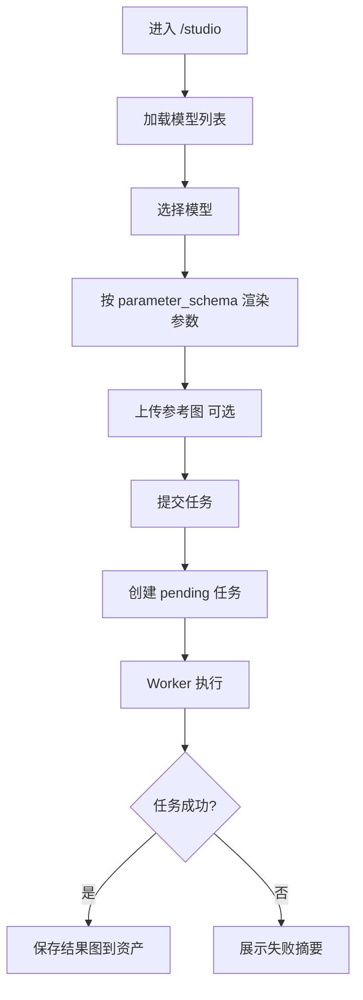
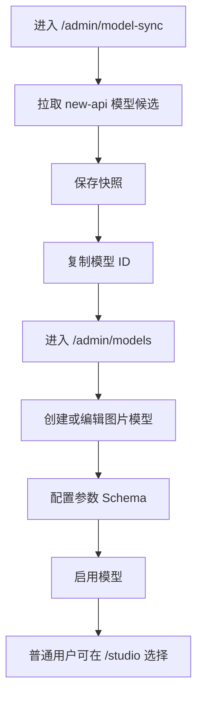

# DreamStudio v1 页面流程、信息架构与开发里程碑

本文档基于 `02-dreamstudio-v1-prd.md`、`03-dreamstudio-v1-architecture.md`、`04-dreamstudio-v1-data-model.md` 和 `05-dreamstudio-v1-api-contract.md` 编写，用于指导页面设计、前端路由、交互流程、开发排期和验收测试。

当前版本状态：确认版。

第六阶段的目标是把已确认的产品、架构、数据模型和接口契约落到用户可见页面与开发执行顺序上。本文档不替代视觉设计稿，但 v1 首页不采用临时轻量占位方案，应在第一版就具备相对完整的产品表达和可信的视觉完成度。

---

## 1. 设计原则

### 1.1 v1 页面只服务主闭环

DreamStudio v1 的页面设计只服务一条主闭环：

```text
注册登录 -> 配置 new-api 密钥 -> 选择图片模型 -> 提交生图任务 -> 查看结果 -> 管理资产
```

管理员闭环：

```text
登录后台 -> 配置系统和存储 -> 配置模型 -> 管理用户密钥状态 -> 排查日志
```

### 1.2 不进入 v1 页面范围

v1 页面不设计：

- 支付页。
- 订阅页。
- 订单页。
- 视频创作页。
- AI 对话页。
- 团队空间。
- 分享页。
- 模板市场。
- 社区页面。

### 1.3 页面优先级

页面优先级从高到低：

1. 首次使用路径必须顺畅。
2. 生图主流程必须稳定。
3. 管理员模型和存储配置必须可用。
4. 日志审计必须能排查问题。
5. 首页需要在 v1 第一版具备完整产品表达，不做临时轻量 Landing。

---

## 2. 用户状态与路由守卫

### 2.1 用户状态

前端需要识别以下状态：

| 状态 | 来源 | 页面行为 |
| --- | --- | --- |
| 未登录 | `GET /api/v1/auth/me` 返回 401 | 进入登录或注册页 |
| 已登录但未配置密钥 | `new_api_config_status` 为空或未配置 | 进入密钥配置引导 |
| 已登录但密钥异常 | `new_api_config_status = invalid` | 进入密钥配置引导并展示错误 |
| 已登录且密钥有效 | `new_api_config_status = valid` | 进入 AI 创作台 |
| 用户被禁用 | API 返回 `forbidden` 或会话失效 | 清理本地状态并展示禁用提示 |
| 超级管理员 | `user.role = super_admin` | 可进入管理后台 |

### 2.2 路由守卫规则

- 访问 `/studio`、`/studio/tasks`、`/studio/assets` 需要登录。
- 普通用户访问 AI 创作相关页面时，需要有效 `new-api` 配置。
- 访问 `/settings/new-api` 只需要登录，不要求密钥有效。
- 访问 `/admin/*` 需要 `super_admin`。
- 超级管理员访问后台不强制要求自己配置 `new-api` 密钥。
- 超级管理员如果访问 AI 创作台，仍按普通用户规则要求有效密钥。
- 被禁用用户不能继续访问任何登录后页面。

### 2.3 页面启动请求

前端应用启动后首先调用：

```http
GET /api/v1/auth/me
```

返回内容用于：

- 判断登录态。
- 判断用户角色。
- 判断 `new-api` 配置状态。
- 获取 CSRF token。
- 决定下一步路由。

---

## 3. 路由结构

### 3.1 推荐 URL

公开页面：

| URL | 页面 |
| --- | --- |
| `/` | 首页 |
| `/auth/login` | 登录页 |
| `/auth/register` | 注册页 |
| `/disabled` | 账号禁用提示页 |

用户页面：

| URL | 页面 |
| --- | --- |
| `/onboarding/new-api` | `new-api` 密钥配置引导 |
| `/studio` | AI 图片创作台 |
| `/studio/tasks` | 任务列表 |
| `/studio/tasks/{task_id}` | 任务详情 |
| `/studio/assets` | 资产仓库 |
| `/settings/account` | 账号设置 |
| `/settings/new-api` | `new-api` 配置 |

管理员页面：

| URL | 页面 |
| --- | --- |
| `/admin` | 管理后台首页 |
| `/admin/users` | 用户管理 |
| `/admin/users/{user_id}` | 用户详情 |
| `/admin/models` | 模型管理 |
| `/admin/model-sync` | 模型候选拉取 |
| `/admin/system-settings` | 系统设置 |
| `/admin/storage-settings` | 存储设置 |
| `/admin/request-logs` | 请求日志 |
| `/admin/audit-logs` | 审计日志 |

### 3.2 Next.js App Router 分组建议

推荐使用路由分组组织页面：

```text
app/
  (public)/
    page.tsx
    auth/
  (app)/
    onboarding/
    studio/
    settings/
  (admin)/
    admin/
```

规则：

- 路由分组不影响实际 URL。
- `(app)` 使用用户登录后布局。
- `(admin)` 使用管理后台布局。
- 页面不要直接调用 `new-api`，只调用 DreamStudio API。

---

## 4. 公共页面

### 4.1 首页 `/`

目标：

- 让用户理解 DreamStudio 是一个浏览器里的 AI 创作平台。
- 引导用户开始使用。
- 不在首屏过度强调技术配置成本。

核心模块：

- 产品名称和一句话定位。
- AI 绘画创作价值说明。
- 开始使用按钮。
- 登录入口。
- 简短说明：使用前需要准备 `new-api` 密钥。

行为：

- 未登录用户点击开始使用进入 `/auth/login` 或 `/auth/register`。
- 已登录且密钥有效进入 `/studio`。
- 已登录但密钥未配置或异常进入 `/onboarding/new-api`。

### 4.2 登录页 `/auth/login`

功能：

- 用户名密码登录。
- 登录错误提示。
- 跳转注册。

状态：

- 登录中。
- 登录失败。
- 用户被禁用。

成功后跳转：

- 密钥有效：`/studio`。
- 密钥未配置或异常：`/onboarding/new-api`。
- 超级管理员主动访问后台入口：`/admin`。

### 4.3 注册页 `/auth/register`

功能：

- 用户名注册。
- 密码注册。
- 展示名可选。
- 跳转登录。

规则：

- 注册是否开放由系统设置控制。
- 注册关闭时展示“暂未开放注册”。
- 注册成功后默认进入 `/onboarding/new-api`。

### 4.4 账号禁用页 `/disabled`

功能：

- 告知用户账号不可用。
- 提供返回首页或重新登录入口。

规则：

- 不展示管理联系方式硬编码。
- 后续如需要客服信息，可由系统设置提供。

---

## 5. 用户页面

### 5.1 密钥配置引导 `/onboarding/new-api`

目标：

- 帮用户完成 DreamStudio 第一次可用配置。

页面内容：

- 说明需要在 `new-api` 中创建 API 密钥。
- 展示默认 `new-api` 服务地址。
- 根据管理员开关决定是否显示服务地址输入框。
- API 密钥输入框。
- 测试连接按钮。
- 保存并进入创作台按钮。

状态：

- 未配置。
- 测试中。
- 测试成功。
- 测试失败。
- 已保存但异常。

规则：

- 密钥保存后不展示明文。
- 连接测试调用 DreamStudio API，再由 API 调用 `GET /v1/models`。
- 测试失败允许保存，但不能进入创作台提交任务。

### 5.2 AI 图片创作台 `/studio`

目标：

- 让用户在一个页面内完成模型选择、参数填写、参考图上传和任务提交。

推荐布局：

- 左侧：固定筛选、搜索框和模型列表。
- 中间：prompt、参考图、参数表单和生成按钮。
- 右侧：最近任务状态和结果预览。

布局结论：

- v1 AI 创作台采用“左模型、中编辑、右任务”的三栏布局。
- 移动端可降级为上下分区或抽屉式模型选择，但信息结构仍保持三栏语义。

核心组件：

- `FixedModelFilterTabs`
- `ModelSearchInput`
- `ModelPicker`
- `PromptEditor`
- `ReferenceImageUploader`
- `ModelParameterForm`
- `GenerateButton`
- `RecentTaskPanel`
- `ResultPreviewGrid`

页面加载接口：

1. `GET /api/v1/me/new-api-config`
2. `GET /api/v1/models`

任务提交接口：

```http
POST /api/v1/image-tasks
```

规则：

- 模型参数面板完全由 `parameter_schema` 驱动。
- 切换模型时保留通用参数，移除不兼容参数。
- 不支持参考图的模型隐藏或禁用参考图上传区。
- 生成按钮点击后生成 `client_request_id`，防止重复提交。
- 提交成功后立即展示 pending 任务卡片。
- 任务进入终态后展示结果或失败摘要。

### 5.3 任务列表 `/studio/tasks`

目标：

- 让用户回看自己的任务状态和历史结果。

功能：

- 状态筛选。
- 模型筛选。
- 任务列表。
- 失败摘要。
- 取消 `pending` 任务。
- 重新提交失败、超时或取消任务。

接口：

- `GET /api/v1/image-tasks`
- `POST /api/v1/image-tasks/{task_id}/cancel`
- `POST /api/v1/image-tasks/{task_id}/retry`

规则：

- `running` 任务展示“不可取消”。
- 任务终态包括 `succeeded`、`failed`、`timeout`、`canceled`。
- 列表默认按创建时间倒序。

### 5.4 任务详情 `/studio/tasks/{task_id}`

目标：

- 展示单个任务的完整可见信息。

内容：

- 任务状态。
- 模型信息。
- prompt 摘要。
- 负面提示词摘要。
- 脱敏参数快照。
- 参考图。
- 结果图。
- 错误摘要。
- 创建时间、开始时间、完成时间。

规则：

- 普通用户不展示完整加密 prompt 的后台解密入口。
- 管理员查看完整 prompt 走请求日志受限接口，不在用户任务详情中提供。

### 5.5 资产仓库 `/studio/assets`

目标：

- 管理用户生成结果图。

功能：

- 结果图列表。
- 图片预览。
- 下载。
- 删除。
- 批量删除。
- 按任务或创建时间筛选。

不展示：

- 参考图列表。

说明：

- 参考图仍会作为任务依赖保存到 storage 和 `assets` 表。
- 参考图只在创作台上传流程和任务详情中展示，不进入资产仓库主列表。

接口：

- `GET /api/v1/assets`
- `GET /api/v1/assets/{asset_id}`
- `GET /api/v1/assets/{asset_id}/download`
- `DELETE /api/v1/assets/{asset_id}`
- `POST /api/v1/assets/batch-delete`

规则：

- 删除前二次确认。
- 删除后不可恢复。
- 默认不展示已删除或已清理资产。

### 5.6 账号设置 `/settings/account`

功能：

- 查看账号信息。
- 修改展示名。
- 修改密码。

接口：

- `GET /api/v1/auth/me`
- `PATCH /api/v1/me/password`

### 5.7 new-api 配置 `/settings/new-api`

功能：

- 查看当前配置状态。
- 查看密钥掩码。
- 更新 API 密钥。
- 测试连接。
- 更新服务地址，前提是管理员允许用户自定义。

接口：

- `GET /api/v1/me/new-api-config`
- `PUT /api/v1/me/new-api-config`
- `POST /api/v1/me/new-api-config/test`

---

## 6. 管理员页面

### 6.1 管理后台首页 `/admin`

目标：

- 给管理员一个清晰的后台导航入口。

v1 结论：

- 后台首页只做导航面板和关键配置入口。
- v1 不强制实现复杂统计卡片。
- 用户总数、今日任务数、失败任务数等统计可以后续迭代。

### 6.2 用户管理 `/admin/users`

功能：

- 用户列表。
- 用户状态筛选。
- 用户名搜索。
- 查看密钥配置状态。
- 启用、禁用、软删除用户。
- 重置用户密码。
- 进入用户详情。

接口：

- `GET /api/v1/admin/users`
- `PATCH /api/v1/admin/users/{user_id}/status`
- `POST /api/v1/admin/users/{user_id}/reset-password`

规则：

- 不展示密钥明文。
- 禁用用户后现有会话失效。
- 敏感操作写审计日志。

### 6.3 用户详情 `/admin/users/{user_id}`

功能：

- 查看用户基础信息。
- 查看用户 `new-api` 配置状态和掩码。
- 管理员代用户配置或替换密钥。
- 管理员清空用户密钥配置。
- 查看该用户近期任务和请求日志入口。

接口：

- `GET /api/v1/admin/users/{user_id}`
- `PUT /api/v1/admin/users/{user_id}/new-api-config`
- `DELETE /api/v1/admin/users/{user_id}/new-api-config`

规则：

- 管理员不能查看已保存密钥明文。
- 代配置或清空密钥必须写审计日志。

### 6.4 模型分类配置废弃

`/admin/model-categories` 不再作为管理入口。模型类型固定为聊天、图片、视频，管理员在 `/admin/models` 中选择模型类型。

### 6.5 模型管理 `/admin/models`

功能：

- 模型列表。
- 新增模型。
- 编辑模型。
- 上传或填写模型图标。
- 配置模型 ID、展示名称、厂商和描述。
- 选择固定模型类型：聊天、图片、视频。
- 启用或禁用模型。
- 设置推荐。
- 多选端点类型。
- 配置参考图传递方式。
- 配置默认参数。
- 配置参数 Schema。

接口：

- `GET /api/v1/admin/models`
- `POST /api/v1/admin/models`
- `GET /api/v1/admin/models/{model_record_id}`
- `PATCH /api/v1/admin/models/{model_record_id}`
- `DELETE /api/v1/admin/models/{model_record_id}`
- `POST /api/v1/admin/model-icons`

规则：

- 默认优先支持 `openai_image_generations` 和 `openai_image_edits`。
- 同一模型可以同时支持生成和编辑端点。
- `gemini_generate_content` 不作为第一验收路径。
- v1 不采用纯 JSON 编辑器作为模型参数 Schema 的主要编辑方式。
- v1 需要提供表单式或可视化参数 Schema 配置器。
- 可以保留“高级 JSON 预览/导入导出”，但不能要求管理员主要通过手写 JSON 完成配置。

### 6.6 模型候选拉取 `/admin/model-sync`

功能：

- 输入临时 `new-api` 服务地址和密钥。
- 或使用管理员自己的已保存配置。
- 调用 `GET /v1/models` 拉取候选模型。
- 保存快照。
- 从快照中复制模型 ID 到模型管理表单。

接口：

- `POST /api/v1/admin/model-sync-snapshots`
- `GET /api/v1/admin/model-sync-snapshots`
- `GET /api/v1/admin/model-sync-snapshots/{snapshot_id}`

规则：

- 候选模型不会自动对普通用户启用。
- 临时密钥不保存。

### 6.7 系统设置 `/admin/system-settings`

功能：

- 默认 `new-api` 服务地址。
- 是否允许用户自定义服务地址。
- 是否开放注册。
- 任务超时时间。
- 最大重试次数。
- 重试间隔。
- 单用户并发。
- 全站并发。
- 请求日志保留时间。
- 审计日志保留时间。

接口：

- `GET /api/v1/admin/system-settings`
- `PATCH /api/v1/admin/system-settings`

### 6.8 存储设置 `/admin/storage-settings`

功能：

- 选择本地存储或 S3 存储。
- 配置本地输入和输出路径。
- 配置 S3 endpoint、region、bucket、prefix、public base URL。
- 配置参考图和结果图保留时间。
- 测试存储配置。

接口：

- `GET /api/v1/admin/storage-settings`
- `PUT /api/v1/admin/storage-settings`
- `POST /api/v1/admin/storage-settings/test`

规则：

- S3 密钥只显示掩码。
- 修改存储配置写审计日志。

### 6.9 请求日志 `/admin/request-logs`

功能：

- 按用户、任务、模型、状态筛选。
- 查看错误摘要。
- 查看脱敏参数。
- 查看耗时和 HTTP 状态码。
- 受限查看完整 prompt。
- 受限查看完整参数快照。

接口：

- `GET /api/v1/admin/request-logs`
- `GET /api/v1/admin/request-logs/{log_id}`
- `POST /api/v1/admin/request-logs/{log_id}/reveal-prompt`
- `POST /api/v1/admin/request-logs/{log_id}/reveal-params`

规则：

- 查看完整 prompt 和完整参数快照必须写审计日志。
- 不展示完整 Authorization Header。

### 6.10 审计日志 `/admin/audit-logs`

功能：

- 按操作类型筛选。
- 按操作者筛选。
- 按目标资源筛选。
- 查看敏感操作记录。

接口：

- `GET /api/v1/admin/audit-logs`

规则：

- 审计日志只允许超级管理员查看。
- 审计日志不记录密钥明文。

---

## 7. 前端状态与组件建议

### 7.1 服务端状态

v1 推荐使用 TanStack Query 管理：

- 登录态查询。
- 模型列表缓存。
- 任务列表轮询。
- 资产列表刷新。
- 管理后台表格分页。

说明：

- 任务轮询是 v1 基线方案。
- SSE 或 WebSocket 可以后续再做，不进入第一验收路径。

### 7.2 表单

v1 推荐：

- `react-hook-form` 管理表单状态。
- `zod` 管理前端校验。
- 后端仍做最终可信校验。

适用表单：

- 登录注册。
- 密钥配置。
- 模型参数 Schema。
- 生图参数。
- 系统设置。
- 存储设置。

### 7.3 布局组件

建议基础布局：

- `PublicLayout`
- `AuthLayout`
- `AppLayout`
- `AdminLayout`
- `RouteGuard`
- `PermissionGate`

### 7.4 业务组件

优先沉淀：

- `NewApiConfigForm`
- `ModelPicker`
- `ParameterSchemaForm`
- `ReferenceImageUploader`
- `ImageTaskCard`
- `ImageTaskStatusBadge`
- `AssetGrid`
- `AdminDataTable`
- `AuditActionDialog`

---

## 8. 关键交互流程

### 8.1 首次使用流程



### 8.2 生图流程



### 8.3 管理员配置模型流程



---

## 9. 开发里程碑

### 9.1 M0 项目骨架

目标：

- 建立可运行的单容器 DreamStudio 基础工程。

包含：

- Next.js Web。
- NestJS API。
- NestJS Worker。
- Prisma。
- PostgreSQL 连接。
- Redis 连接。
- BullMQ 基础队列。
- Docker Compose 示例。
- `/healthz` 和 `/readyz`。

验收：

- 本地能启动 DreamStudio。
- 能连接本地或云 PostgreSQL。
- 能连接本地或云 Redis。
- API、Web、Worker 进程日志可见。

### 9.2 M1 认证与用户基础

目标：

- 用户能注册、登录和进入受保护页面。

包含：

- 用户表迁移。
- 会话表迁移。
- Cookie 会话。
- CSRF。
- 注册。
- 登录。
- 登出。
- `GET /api/v1/auth/me`。
- 修改密码。
- 路由守卫。

验收：

- 普通用户能注册登录。
- 被禁用用户不能登录。
- 页面刷新后能恢复登录态和 CSRF token。

### 9.3 M2 new-api 配置与系统设置

目标：

- 用户能配置自己的 `new-api` 密钥，管理员能配置默认服务地址。

包含：

- `user_new_api_configs`。
- AES-256-GCM 加密服务。
- 系统设置表。
- 用户密钥配置页。
- 管理员系统设置页。
- 连接测试 `GET /v1/models`。
- 管理员代用户配置或清空密钥。
- 审计日志基础能力。

验收：

- 密钥不明文保存。
- 密钥不通过查询接口返回。
- 测试失败的配置不能提交生图任务。
- 管理员代配置密钥写审计日志。

### 9.4 M3 模型目录与参数 Schema

目标：

- 管理员能配置图片模型，普通用户能看到可用模型。

包含：

- 固定模型类型。
- 模型管理。
- 表单式或可视化参数 Schema 配置器。
- 模型候选拉取。
- 普通用户模型列表。
- `ParameterSchemaForm`。

验收：

- 管理员可以启用至少一个图片模型。
- 普通用户只能看到启用模型。
- 前端能根据参数 Schema 渲染表单。
- 后端能按参数 Schema 校验任务参数。

### 9.5 M4 存储、资产与上传

目标：

- 系统能保存参考图和结果图资产。

包含：

- 存储设置。
- 本地存储适配。
- S3 存储适配。
- 参考图上传。
- 资产列表。
- 资产下载。
- 资产删除和批量删除。
- 过期清理队列基础。

验收：

- 用户能上传参考图。
- 用户能查看、下载、删除自己的资产。
- S3 密钥不明文保存。
- 删除资产会同步删除物理文件。

### 9.6 M5 图片任务与 Worker 主闭环

目标：

- 用户能提交图片任务，Worker 能调用 `new-api` 并保存结果。

包含：

- `image_tasks`。
- `image_task_attempts`。
- `request_logs`。
- `image-generation` 队列。
- Worker 调用 `/v1/images/generations`。
- Worker 调用 `/v1/images/edits`。
- base64 结果保存。
- URL 结果下载保存。
- 任务轮询。
- pending 任务取消。
- 失败重试。

验收：

- 用户关闭页面后任务继续执行。
- 成功任务生成结果图资产。
- 失败任务展示可读错误摘要。
- `pending` 任务可取消。
- `running` 任务返回不可取消。
- 请求日志不记录密钥。

### 9.7 M6 管理后台与日志审计完善

目标：

- 管理员能管理用户、排查问题、查看审计。

包含：

- 用户管理。
- 用户详情。
- 请求日志列表和详情。
- 受限查看完整 prompt。
- 受限查看完整参数快照。
- 审计日志列表。
- 存储测试。
- 日志保留时间配置。

验收：

- 管理员能禁用用户并使会话失效。
- 管理员能排查失败任务。
- 查看完整 prompt 和完整参数快照写审计日志。

### 9.8 M7 部署、测试与发布准备

目标：

- v1 达到可部署和可验收状态。

包含：

- Dockerfile。
- Compose 示例。
- 云 PostgreSQL 和云 Redis 配置说明。
- 环境变量文档。
- 数据库迁移说明。
- 本地存储挂载说明。
- S3 配置说明。
- 备份预留说明。
- 核心 E2E 测试。

验收：

- Docker Compose 可以启动单应用容器。
- 可连接本地或云 PostgreSQL/Redis。
- 主流程 E2E 通过。
- 部署文档能指导维护人员完成最小部署。

---

## 10. 开发顺序建议

推荐顺序：

1. M0 项目骨架。
2. M1 认证与用户基础。
3. M2 `new-api` 配置与系统设置。
4. M3 模型目录与参数 Schema。
5. M4 存储、资产与上传。
6. M5 图片任务与 Worker 主闭环。
7. M6 管理后台与日志审计完善。
8. M7 部署、测试与发布准备。

不建议先做：

- 复杂仪表盘统计。
- SSE 或 WebSocket。
- 多角色权限体系。
- 支付和订阅。

原因：

- v1 最大风险不是视觉，而是密钥、模型、任务、存储和 Worker 的主闭环是否稳定。
- 但首页和参数 Schema 配置器已经进入 v1 基础体验，不能用临时占位或纯 JSON 表单替代。

---

## 11. 第六阶段确认项

以下问题已按当前产品方向确认：

- AI 创作台采用“左模型、中编辑、右任务”的三栏布局。
- 资产仓库不展示参考图，只展示结果图。
- 模型参数 Schema v1 不接受纯 JSON 编辑器作为后台初版，必须提供表单式或可视化配置器。
- 后台首页 v1 只做导航面板，不做复杂统计。
- 首页 v1 不做临时轻量 Landing，第一版就需要具备完整产品表达和可信视觉完成度。
